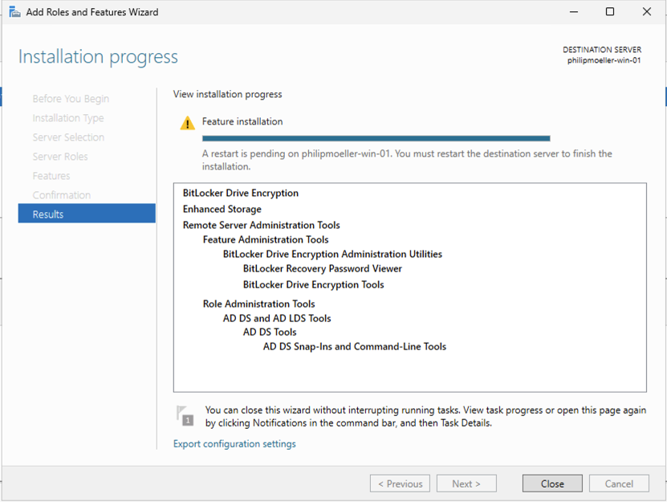

Exoscale supports vTPM and Secureboot technology to allow usage of Windows security features like Bitlocker drive encryption. The required key to unlock the drive is safely stored in the vTPM and no interaction is required when rebooting the server. A recovery key is stored to allow recovery if the VM is migrated off Exoscale or the vTPM is lost.

## Prerequisites
As prerequisites you'll have to:
* access to Exoscale environment UI
* Sufficient rights to create a compute instance

## Create a Windows compute instance with vTPM and Secureboot enabled
Via the Portal UI
* Configure a Microsoft Windows Server instance as you need
* Add one Block Storage Volume with 1GiB size - this will be used to store the Bitlocker Recovery Key during configuration
* In the bottom of the configuration page select "TPM enabled" and "Secureboot" enabled
* Create the instance


Via the API
* Add the following extensions to the create-instance API call:
```
"tpm-enabled": true,
"secureboot-enabled": true
```

## Install Bitlocker and required features
Via GUI
* Configure the additional Block Storage Volume and format it.
* Open the Server Manager and click on "Manage" -> "Add Roles and Features"
* On the "Features" tab of the Wizard select "Bitlocker Drive Encryption" and add all required Features
* Finish the Wizard and reboot once the installation of the Feature is done

* After the reboot access the Windows Server and open the Explorer
* Navigate to "This PC" and right click on the drive selected for encryption, click on "Turn on Bitlocker"

* Follow the Wizard until asked how to backup the Recovery Key. Select "Save to a file" and select the 1GiB block volume, create a folder and store the file into that folder

* Finish the Wizard to start encryption. You can let Windows Run the Bitlocker check before by selecting "Run Bitlocker system check", a reboot is required.
* Click on "Start encrypting"
* Open the explorer and navigate to the Block Storage Volume and copy the Recovery Key off to an safe destination outside of the compute instance itself. Our SOS Object Storage is an example for a safe place to store the key.
* Check the encryption is ongoing by openeing the Explorer, navigate to "This PC". Select "Manage Bitlocker" in the menu when right clicking on the disk. It should show "Bitlocker Encrypting" until the disk is encrypted, the status shows "Bitlocker on" once the disk is fully encrypted


Via Powershell
* Configure the additional Block Storage Volume and format it.
* Open a Powershell terminal with elevated rights
* Install Bitlocker and required features:
```
PS C:\Users\Administrator> Install-WindowsFeature BitLocker -IncludeAllSubFeature -IncludeManagementTools
```
* A reboot is required to finish the installation
* After the reboot access the Windows Server and open a Powershell terminal with elevated rights
* Enabled Bitlocker drive encryption on the selected drive:
```
PS C:\Users\Administrator> Enable-BitLocker -MountPoint "C:" -EncryptionMethod "XtsAes256" -TpmProtector -UsedSpaceOnly -SkipHardwareTest
```
* Bitlocker will start to encrypt your drive. To check the status use:
```
PS C:\Users\Administrator> Get-BitLockerVolume
```
* Create the recovery key:
```
PS C:\Users\Administrator> Add-BitLockerKeyProtector -MountPoint "C:" -RecoveryKeyProtector -RecoveryKeyPath "D:"
PS C:\Users\Administrator> (Get-BitLockerVolume -MountPoint "C:").KeyProtector > "D:\RecoveryKey\C-drive.txt"
```
* Copy the Recovery Key to a safe location outside of the compute instance. Our SOS Object Storage is an example for a safe place to store the key.
